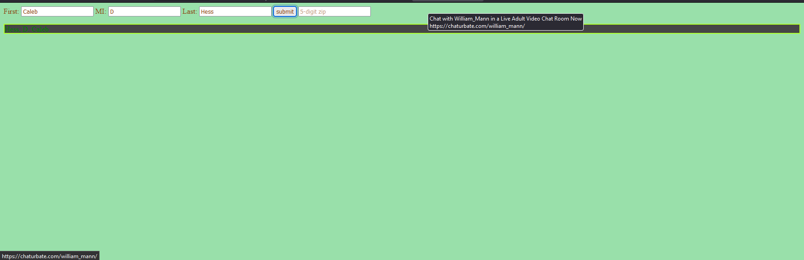
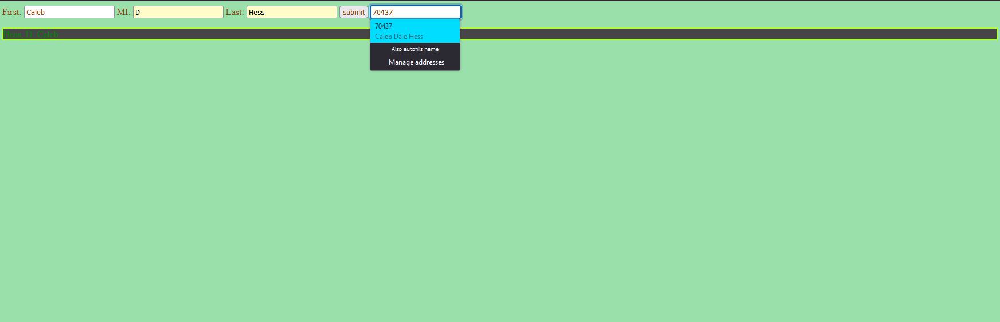

# csc102-Assignment-3.2
Assignment 3.2 User Input validation

*** files ***
- index.html
- styles.css
- screencapture-start.png
-  
Initial state of webpage
- screencapture-mid.png
-  
 After name check
- screencapture-mid-2.png
-  
before zipCode submits
- screencapture-end.png
- 
